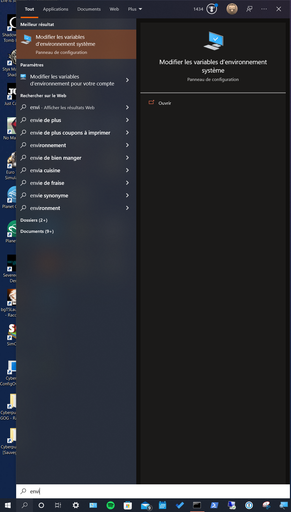
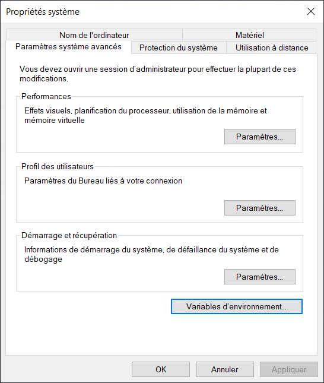
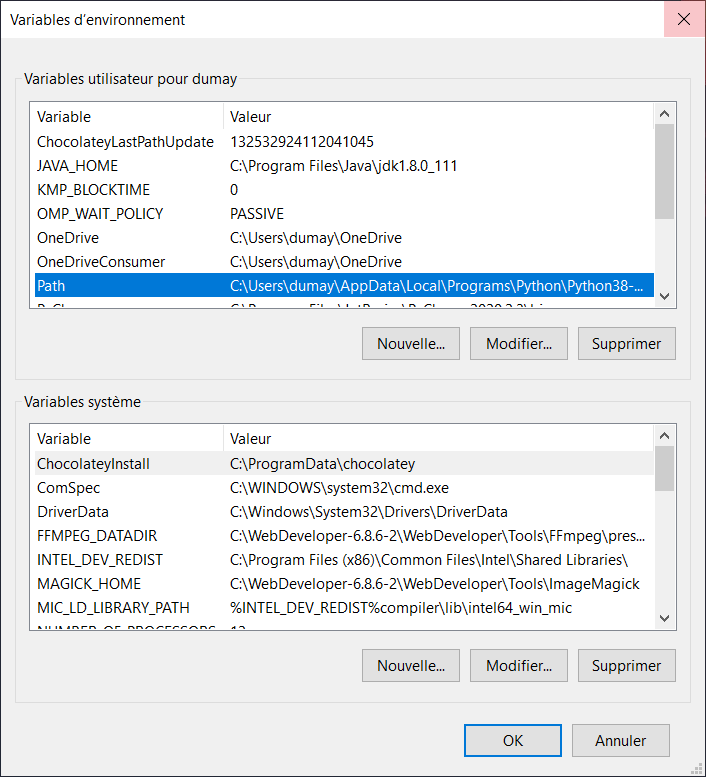
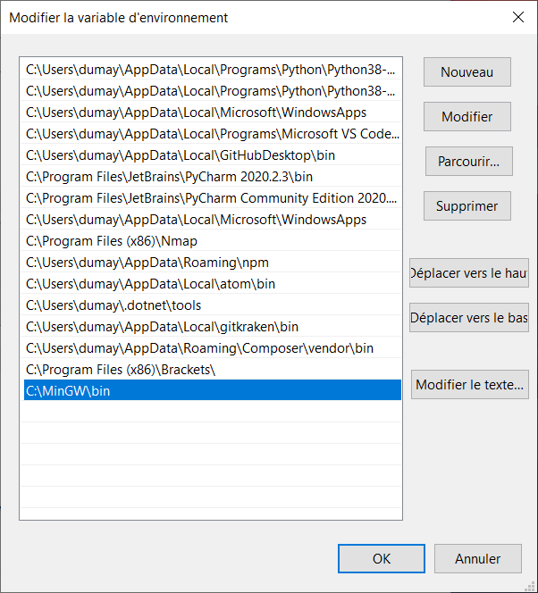

# Le langage C

[<== Retour ](../../)

## 1 - Les pré-requis - compilateur **GCC**

Pour pouvoir créer une programme un langage **C**, vous allez avoir besoin d'un compilateur afin de créer le ficier exécutable.

Normalement, un compilateur pour les programmes **C** est déjà présent avec **Windows**, **Linux** et **MacOS**.

N'hésitez pas à vérifier cela avant de vous lancer. 

### 1.1 - Vérifier et installer GCC sur Windows

#### 1.1.1 - Vérifier GCC

Pour mon cas, **GCC** n'est pas trouvable.

Pour savoir si vous vous trouvez dans le même cas que moi :

1. Ouvrez simplement ou nouveau terminal/console
2. Effectuez la commande : `ggc`

##### Si GCC est installé

```
C:\Users\dumay>gcc
gcc: fatal error: no input files
compilation terminated.
```

**GCC** est bien installé et vous affiche une erreur de compilation car aucun fichier n'a été préciser pour une compilation éventuelle. Dans ce cas, vous pouvez commencer à apprendre le langage **C**.

##### Si GCC n'est pas installé

```
C:\Users\ldumay>gcc
'gcc' n’est pas reconnu en tant que commande interne
ou externe, un programme exécutable ou un fichier de commandes.
```

Si vous obtenez la même erreur que celle-ci dessus, vous voilà dans la même posture que moi-même, et donc **GCC** n'est pas installé. Il est donc nécessaire de l'installé et l'ajouter au `PATH` de la console.

#### 1.1.2 - Installer GCC via MinGW

Pour installer **GCC**, il est existe un logiciel complet intégrant le compilateur `gcc.exe` que le recherche. Celui-ci est **MinGW**.

Né en 1998, le projet ralenti en 2005-2008 car la 1ère version ne supporte que les environnements d'exécution 32 bits. A cela, est né le une suite d'intégration des environnements d'exécution 64 bits.

Pour plus avoir plus d'informations sur le projet **MinGW**, wikipédia possède une page dédiée [ici](https://fr.wikipedia.org/wiki/MinGW).

- Pour 32bits - **MinGW** (ou **Mingw32 - Minimalist GNU for Windows**) - A native Windows port of the GNU Compiler Collection (GCC) : 
  - [Lien du site **officiel** du projet](https://osdn.net/projects/mingw/)
  - [Lien - mirroir **sourceforge.net**](https://sourceforge.net/projects/mingw/)
- Pour 64bits - **MinGW-w64** : 
  - [Lien du site officiel](https://www.mingw-w64.org/)

##### 1.1.3 - Liaison de GCC à la console

A la suite de l'installation de **Mingw32 ** sur mon environnement, j'ai comme adresse de dossier d'installation du logiciel : `C:\MinGW\bin`.

L'idée est donc d'ajouter cette adresse de dossier à **mes variables d'environnements**.

Pour ce faire, suivez la étapes ci-dessous.



Dans votre barre de recherche Windows, écrivez **environnements**, ce qui devrais faire apparaitre **Modifier les variables d'environnement système** (ou **pour votre compte**) . 

Puis lancer le.



Dans la fenêtre qui s'est ouverte, cliquer sur **variables d'environnement...** .



Un nouvelle fenêtre s'ouvre. Sélectionner la variable **Path** dans la 1ère liste déroulante, puis cliquer sur **Modifier**.



Une dernière fenêtre apparait. Ajouter ici votre adresse de dossier en cliquant sur **Nouveau**.

Vous pouvez maintenant fermer chaque fenêtre ouvertes en cliquant sur **OK** de chacune d'elle.

Fermer toutes les consoles ouvertes, puis ré-ouvrez une nouvelle console et effectuez enfin la commande `gcc`.

Vous devriez normalement avoir le résultat ci-dessous.

```
C:\Users\dumay>gcc
gcc: fatal error: no input files
compilation terminated.
```

Votre compilateur est maintenant prêt.

### 2 - Compilation de programme

Afin de compiler un programme **C** :

- Ouvrez une nouvelle console.
- Déplacer vous dans le dossier de votre projet, tel que `> cd /documents/mes_projets/` (ceci est un exemple).
- Effectuez la commande `gcc` avec l'option `-o` permettant de saisir un nom à votre fichier exécutable, tel que :

```
gcc -o <nom_du_fichier_exécutable>.exe <nom_du_fichier_principal_du_projet>.c
```

Exemple d'essai avec un projet de démo :

```
F:\LangageC\Test_1>gcc -o test.exe main.c
```

Résultat
```
.
├── main.c
└── test.exe
```

Vous savez maintenant compiler un programme **C** en tant que fichier executable.

## 2 - Programmer en langage C

Pour coder en langage C, plusieurs éléments sont à connaitre :

- 2.1 - Les variables
- 2.2 - Les opérations
- 2.3 - Les conditions
- 2.4 - Les fonctions
- 2.5 - Les librairies
- 2.6 - Les pointeurs
- 2.7 - Les tableaux
- 2.8 - Les chaîne de caractères
- 2.9 - Définir une valeur à un mot
- 2.10 - Les macros
- 2.11 - Les conditions en langage préprocesseur
- 2.12 - Evitez les inclusions infinies

### 2.1 - Les variables et possibilités :

#### Les entiers :
- int =>
- signed char => [ min : -127 | max : 127 ]
- int => [ min : -32 767 | max : 32 767 ]
- long => [ min : -2 147 483 647 | max : 2 147 483 647 ]

#### Les nombres décimaux :
- float => [ min : -1 x1037 | max : 1 x1037 ]
- double => [ min : -1 x1037 | max : 1 x1037 ]

#### Les entiers non signés :
- unsigned char [ 0 à 255 ]
- unsigned int [ 0 à 65 535 ]
- unsigned long [ 0 à 4 294 967 295 ]

#### Pour faire des variables constantes :

```
const int bonbon_acide_niveau = 50;
```

#### Pour afficher le contenu d'une variable :

```
printf("entier est %d", entier);
```

#### Pour afficher une variable selon son type :

- "%d" => int
- "%u" => unsigned int
- "%ld" => long
- "%f" => float, double

#### Saisir de donnée dans la console : 

```
scanf("%d", &entier);
```

### 2.2 - Les opérations de variables et concaténation :

#### Les opérations de variables 

- => + Addition
- => - Soustraction
- => * Multiplication
- => / Division
- => % Modulo

Exemple :

`a = a + b + c`

`d = f * g / ( h % j )`

Possible :

`a = a + b` OU `a += b`

Aussi :

`a = a + 1` OU `a += a` OU `a++`

#### La concaténation

Voici quqleus variables initiales :

```
int nbBonbons = 20;
char boiteBonbons = "Je possède 1 boîte à bonbon";
```

Il y possible de concaténer en entier dans une chaîne de caractère.

`boiteBonbons = boiteBonbons + " et " + nbBonbons + "bonbons.";`

OU

`boiteBonbons += " et " + nbBonbons + "bonbons.";`

La chaîne de caractère affichera :

**"Je possède 1 boîte à bonbon et 20 bonbons."**

### 2.3 - les conditions

#### Symboles conditionnels

- `==` est égal à
- `>` est supérieur à
- `<` est inférieur à
- `>=` est supérieur ou égal à
- `<=` est inférieur ou égal à
- `!=` est différent de

#### Multiplicateurs de conditions

- `&&` ET
- `||` OU
- `!` NON

#### IF / IF ELSE / ELSE (SI / SINON SI / SINON)

```
int age = 18
int majeur = 0 // 1 si majeur

//SI
if (age < 18){
    majeur = 0;
}
//SINON SI
else if (age >= 18 && age < 25){
    majeur++;
}
//SINON SI
else if (age >= 26){
    majeur++;
}
//SINON
else {
    majeur++;
}
```

#### SWITCH

```
switch (age) {
    case 2:
        printf("Salut bebe !");
        break;
    case 6:
        printf("Salut gamin !");
        break;
    case 12:
        printf("Salut jeune !");
        break;
    case 16:
        printf("Salut ado !");
        break;
    case 18:
        printf("Salut adulte !");
        break;
    case 68:
        printf("Salut papy !");
        break;
    default:
        printf("Je n'ai aucune reponse pour ton age");
        break;
}
```

#### WHILE

```
int compteur = 0;
while (compteur < 10) {
    printf("Compteur %d\n", compteur);
    compteur++;
}
```

#### DO ... WHILE

```
int compteur = 0;
do {
    printf("Compteur %d\n", compteur);
    compteur++;
} while (compteur < 10);
```

> **NB** : WHILE vs DO ... WHILE :
> La boucle do ... while s'exécutera toujours au moins une fois.

#### FOR

```
for (compteur = 0;, compteur < 10; compteur++) {
    printf("Compteur %d\n", compteur);
}
```

### 2.4 - les fonctions

```
<type_de_variable_retourner> nomFonction(parametres) {
    // Insérez vos instructions ici
}
```

> **NB** : Les fonctions ne retourne pas forcémement de variable(s). Dans ce cas, le type de variable retourner est vide, donc `void`.

Exemple de fonction :

```
void helloWorld(){
    printf("Hello world!\n");
}
```

OU

```
double nbPaire(double nb) {
    resultat = nb % 2;
    return resultat;
}
```

### 2.5 - les librairies

#### Pour importer une librairie :

En langage C, la majorité des libraires de trouve déjà sur votre OS.
Voici donc la méthode permettenant d'importer une librairie, ci-dessous :

```
#include <nom_de_la_librairie_cible>
```

> **ATTENTION**, d'un OS à l'autre celles-ci sont différents ou inéxistantes.

#### Pour importer un fichier :

```
#include "nom_du_fichier_cible"
```

#### Quelques librairies pour commencer :

[Disponibles ici](/langage_c_librairies.md)

### 2.6 - Les pointeurs

**[à venir]**

### 2.7 - Les tableaux

```
int tableau[4]; //possède toujours une taille

tableau[0] = 10;
tableau[1] = 23;
tableau[2] = 505;
tableau[3] = 8;

printf("%d", tableau[0]);
```

### 2.8 - Les chaîne de caractères

#### a - Les cractères

Elles peuvent être placées dans un `char` ou un `int`.

Pour l'afficher, ce sera : `"%c"`.

#### b - Pour stocker une chaîne de caractère

##### => Méthode 1

```
char chaine[5];
chaine [0] = 's';
chaine [1] = 'a';
chaine [2] = 'l';
chaine [3] = 'u';
chaine [4] = 't';
```

##### => Méthode 2

```
char chaine[] = 'salut';
```

##### =>  Pour afficher une chaîne de cractères

Pour l'afficher, ce sera : `"%s"`.

#### Import de la bibliothèque de calculs des chaînes

`#include <string.h>`

Principales fonctions :

- strlen pour calculer la longueur d'une chaîne.
- strcpy pour copier une chaîne dans une autre.
- strcat pour concaténer 2 chaînes.
- strcmp pour comparer 2 chaînes.
- strchr pour rechercher un caractère.
- strpbrk pour rechercher le premier caractère de la liste.
- strstr pour rechercher une chaîne dans une autre.
- sprintf pour écrire dans une chaîne.

[Plus de détails avec OpenClassroom](https://openclassrooms.com/fr/courses/19980-apprenez-a-programmer-en-c/7672681-manipulez-du-texte-avec-les-chaines-de-caracteres#/id/r-7672851)

### 2.9 - Définir une valeur à un mot

```
#define LARGEUR_FENETRE  800
#define HAUTEUR_FENETRE  600
#define NOMBRE_PIXELS    (LARGEUR_FENETRE * HAUTEUR_FENETRE)
```

Constantes existante du processeur :

- `__LINE__` donne le numéro de la ligne actuelle.
- `__FILE__` donne le nom du fichier actuel.
- `__DATE__` donne la date de la compilation.
- `__TIME__` donne l'heure de la compilation.

### 2.10 - Les macros

```
#define COUCOU() printf("Coucou");

#define RACONTER_SA_VIE()   printf("Coucou, je m'appelle Brice\n"); \
                            printf("J'habite a Nice\n"); \
                            printf("J'aime la glisse\n");
                            
#define MAJEUR(age) if (age >= 18) \
                    printf("Vous etes majeur\n");
```

### 2.11 - Les conditions en langage préprocesseur

Modèle
```
#if condition
    /* Code source à compiler si la condition est vraie */
#elif condition2
    /* Sinon si la condition 2 est vraie compiler ce code source */
#endif
```

Exemple
```
#define WINDOWS

#ifdef WINDOWS
    /* Code source pour Windows */
#endif

#ifdef LINUX
    /* Code source pour Linux */
#endif

#ifdef MAC
    /* Code source pour Mac */
#endif
```

### 2.12 - Evitez les inclusions infinies

```
#ifndef DEF_NOMDUFICHIER // Si la constante n'a pas été définie le fichier n'a jamais été inclus
#define DEF_NOMDUFICHIER // On définit la constante pour que la prochaine fois le fichier ne soit plus inclus

/* Contenu de votre fichier .h (autres include, prototypes, define...) */

#endif
```
[Plus de détails avec OpenClassroom](https://openclassrooms.com/fr/courses/19980-apprenez-a-programmer-en-c/7673041-utilisez-les-directives-du-preprocesseur#/id/r-7673213)


---

[Source d'aide du tuto](https://openclassrooms.com/fr/courses/19980-apprenez-a-programmer-en-c)

Autres - en cours :

- https://pixees.fr/informatiquelycee/n_site/nsi_prem_langageC.html
- http://sdz.tdct.org/sdz/le-langage-c-1.html
- https://zestedesavoir.com/tutoriels/755/le-langage-c-1/
- https://boowiki.info/art/bibliotheque-standard-c/conio-h.html
- https://www.coursexercices.com/PDF_Cours_Exercices_Telecharger.php?q=la+biblioth%C3%A8que+conio.h+en+c